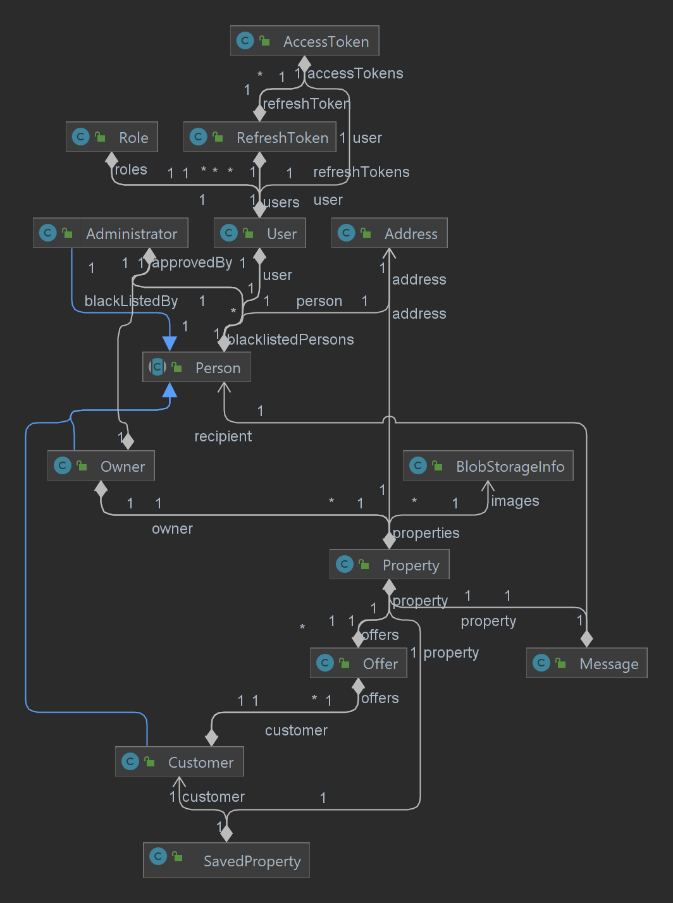
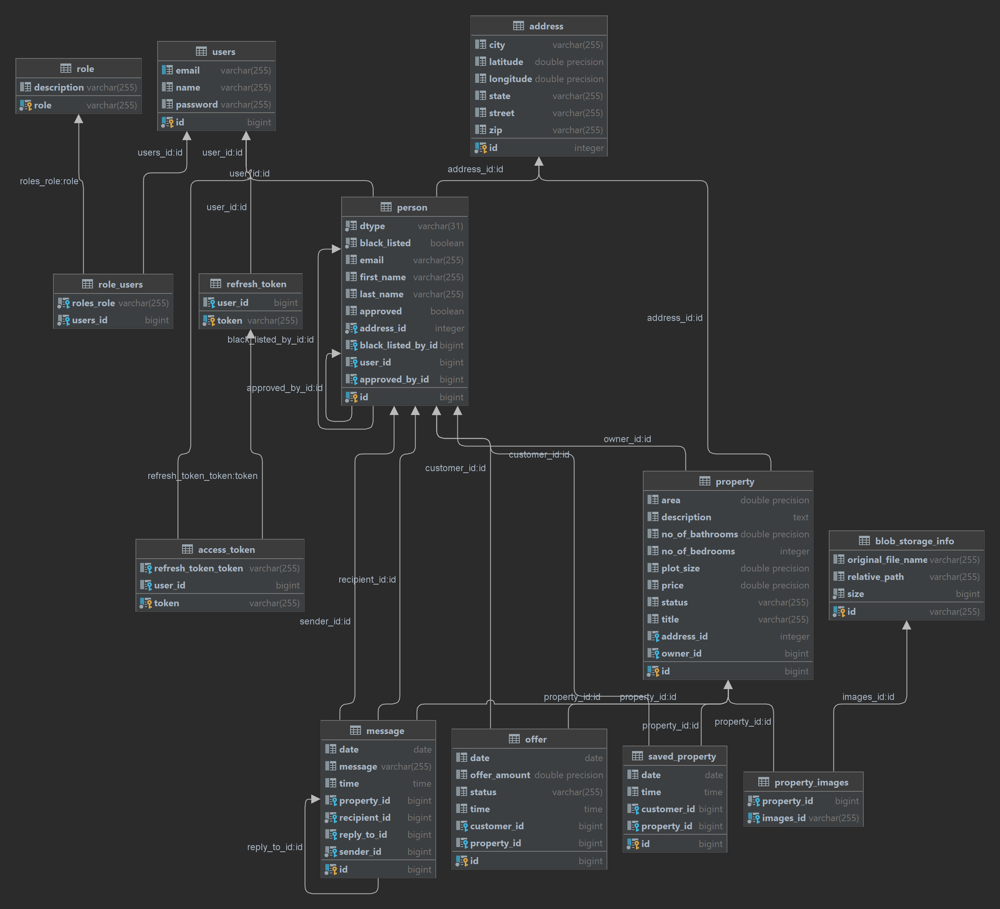

**CS 545 - Web Application Architecture**

**Project Requirements - (React + Spring)**

This is an engineering proof of concept. The goal is to get some hands-on experience building a full-stack project with Spring and React technologies.

 

**Project Topic – Mini Property Management System**

| **Feature**                                                  | **Done** |
| ------------------------------------------------------------ | -------- |
| **Admin**                                                    | Done     |
| a.    The admin should have a dashboard page                 | Done     |
| b.   If the owner registers to the web site, he/she need to get approval  from Admin in order to post properties. | Done     |
| **Owner**                                                    | Done     |
| a.    Register as Owner                                      | Done     |
| b.   Property (CRUD). If a property is under ‘**pending’** it cannot be deleted. | Done     |
| c.    Owner cannot submit offers on property from the website | Done     |
| d.   Maintain offers:  a)   Reject offer if the owner does not accept. The property status should remain  ‘**available**’   b)   If ‘**pending**’ phase get accepted from both sides. The property status becomes ‘**contingent**’.  c)   Receive messages from a customer (General inquires NOT an offer)  d)   Cancel contingency  e)   Maintain offers placed (list of placed offers) | Done     |
| **Customer**                                                 | Done     |
| a.    Register as Customer                                   | Done     |
| b.   Cannot offer properties on this website                 | Done     |
| a)   Customer actions:  a)   Check offer History  b)   Maintain current offers placed  c)   Cannot cancel offer after ‘contingency’  d)   Download/Print receipt as PDF or Excel  e)   Place offer, the property status will be changed to ‘**pending**’ if the offer  gets accepted  f)    Send message to the property owner  g)   Maintain Saved List | Done     |
| **General**                                                  | Done     |
| Login/Logout                                                 | Done     |
| Security with JWT (Users should not be able to  access other pages links) | Done     |
| Process verifications etc. (user get email of  purchase, gets a message)  Adding refresh tokens (Optional) | Done     |
| Validation is optional.                                      | Done     |
| **Technical aspects**                                        | Done     |
| Neat code and organization                                   | Done     |
| Managed packages, folders, and files                         | Done     |
|                                                              |          |
|                                                              |          |

## Running the project

- Take a checkout
  - To run the backend (API)
    - `cd ./src/api`
    - `./mvnw spring-boot:run`
  - To  run the front end Single Page Application (SPA)
    - `cd ./src/spa/`
    - `npm install`
    - `npm start`
- Navigate to `http://localhost:3000` from your browser
- *Note*: 
  - The images are served from a Azure blob storage, if the storage is not running configure it in `application.properties` file
  - The CORS policy is configured to `http://localhost:3000` 
  - All the html input fields are required. 
    - The validations are omitted due to time constraints and server will only return an error, without helpful information.
  - The 

Pre-defined users:

|      | Username              | Password |
| ---- | --------------------- | -------- |
| 1    | admin@admin.com       | admin    |
| 2    | customer@customer.com | customer |
| 3    | owner@owner.com       | owner    |

### Diagrams

### Folder Structure

`

 |-.git
 |-LICENSE
 |-README.md
 |-src
 | |-api
 | | |-.gitignore
 | | |-.mvn
 | | | |-wrapper
 | | | | |-maven-wrapper.jar
 | | | | |-maven-wrapper.properties
 | | |-api.iml
 | | |-HELP.md
 | | |-logs
 | | | |-student-project.log
 | | |-mvnw
 | | |-mvnw.cmd
 | | |-pom.xml
 | | |-src
 | | | |-main
 | | | | |-java
 | | | | | |-edu
 | | | | | | |-miu
 | | | | | | | |-cs545
 | | | | | | | | |-api
 | | | | | | | | | |-ApiApplication.java
 | | | | | | | | | |-config
 | | | | | | | | | | |-Beans.java
 | | | | | | | | | | |-init
 | | | | | | | | | | | |-AuthEntryCreator.java
 | | | | | | | | | | |-SecurityConfig.java
 | | | | | | | | | |-controller
 | | | | | | | | | | |-AdministratorController.java
 | | | | | | | | | | |-AuthController.java
 | | | | | | | | | | |-ControllerSecurityUtil.java
 | | | | | | | | | | |-CustomerController.java
 | | | | | | | | | | |-FileUploadController.java
 | | | | | | | | | | |-MessageController.java
 | | | | | | | | | | |-OwnerController.java
 | | | | | | | | | | |-PdfController.java
 | | | | | | | | | | |-PropertyController.java
 | | | | | | | | | | |-SavedPropertyController.java
 | | | | | | | | | | |-UserController.java
 | | | | | | | | | |-dto
 | | | | | | | | | | |-AddressDto.java
 | | | | | | | | | | |-AdministratorDto.java
 | | | | | | | | | | |-AuthDto.java
 | | | | | | | | | | |-CustomerDto.java
 | | | | | | | | | | |-ImageFileInfoConverter.java
 | | | | | | | | | | |-ImageFileInfoDto.java
 | | | | | | | | | | |-JwtResponseDto.java
 | | | | | | | | | | |-MessageDto.java
 | | | | | | | | | | |-OfferDto.java
 | | | | | | | | | | |-OwnerDto.java
 | | | | | | | | | | |-PersonDto.java
 | | | | | | | | | | |-PropertyDto.java
 | | | | | | | | | | |-RefreshDto.java
 | | | | | | | | | | |-RoleDto.java
 | | | | | | | | | | |-SavedPropertyDto.java
 | | | | | | | | | | |-UserDto.java
 | | | | | | | | | |-entity
 | | | | | | | | | | |-AccessToken.java
 | | | | | | | | | | |-Address.java
 | | | | | | | | | | |-Administrator.java
 | | | | | | | | | | |-BlobStorageInfo.java
 | | | | | | | | | | |-Customer.java
 | | | | | | | | | | |-Message.java
 | | | | | | | | | | |-Offer.java
 | | | | | | | | | | |-OfferState.java
 | | | | | | | | | | |-Owner.java
 | | | | | | | | | | |-Person.java
 | | | | | | | | | | |-Property.java
 | | | | | | | | | | |-PropertyState.java
 | | | | | | | | | | |-RefreshToken.java
 | | | | | | | | | | |-Role.java
 | | | | | | | | | | |-RoleTypes.java
 | | | | | | | | | | |-SavedProperty.java
 | | | | | | | | | | |-User.java
 | | | | | | | | | |-filter
 | | | | | | | | | | |-JwtFilter.java
 | | | | | | | | | |-repository
 | | | | | | | | | | |-AccessTokenRepository.java
 | | | | | | | | | | |-AddressRepository.java
 | | | | | | | | | | |-AdministratorRepository.java
 | | | | | | | | | | |-BlobStorageInfoRepository.java
 | | | | | | | | | | |-CustomerRepository.java
 | | | | | | | | | | |-MessageRepository.java
 | | | | | | | | | | |-OfferRepository.java
 | | | | | | | | | | |-OwnerRepository.java
 | | | | | | | | | | |-PersonRepository.java
 | | | | | | | | | | |-PropertyRepository.java
 | | | | | | | | | | |-RefreshTokenRepository.java
 | | | | | | | | | | |-RoleRepository.java
 | | | | | | | | | | |-SavedPropertyRepository.java
 | | | | | | | | | | |-UserRepository.java
 | | | | | | | | | |-service
 | | | | | | | | | | |-AccessTokenService.java
 | | | | | | | | | | |-AccessTokenServiceImpl.java
 | | | | | | | | | | |-AdministratorService.java
 | | | | | | | | | | |-AdministratorServiceImpl.java
 | | | | | | | | | | |-AuthService.java
 | | | | | | | | | | |-AuthServiceImpl.java
 | | | | | | | | | | |-BlobStorageService.java
 | | | | | | | | | | |-BlobStorageServiceImpl.java
 | | | | | | | | | | |-CustomerService.java
 | | | | | | | | | | |-CustomerServiceImpl.java
 | | | | | | | | | | |-MessageService.java
 | | | | | | | | | | |-MessageServiceImpl.java
 | | | | | | | | | | |-OfferService.java
 | | | | | | | | | | |-OfferServiceImpl.java
 | | | | | | | | | | |-OwnerService.java
 | | | | | | | | | | |-OwnerServiceImpl.java
 | | | | | | | | | | |-PdfService.java
 | | | | | | | | | | |-PdfServiceImpl.java
 | | | | | | | | | | |-PropertyService.java
 | | | | | | | | | | |-PropertyServiceImpl.java
 | | | | | | | | | | |-RoleService.java
 | | | | | | | | | | |-RoleServiceImpl.java
 | | | | | | | | | | |-SavedPropertyService.java
 | | | | | | | | | | |-SavedPropertyServiceImpl.java
 | | | | | | | | | | |-UserService.java
 | | | | | | | | | | |-UserServiceImpl.java
 | | | | | | | | | |-util
 | | | | | | | | | | |-JwtUtil.java
 | | | | |-resources
 | | | | | |-application.properties
 | | | | | |-application.yml
 | | | | | |-import.sql
 | | | | | |-static
 | | | | | |-templates
 | | | |-test
 | | | | |-java
 | | | | | |-edu
 | | | | | | |-miu
 | | | | | | | |-cs545
 | | | | | | | | |-api
 | | | | | | | | | |-ApiApplicationTests.java
 | | | | | | | | | |-controller
 | | | | | | | | | | |-AuthControllerIT.java
 | | | | | | | | | | |-AuthControllerTest.java
 | | | | |-resources
 | | | | | |-application-test.properties

 

 | |-spa
 | | |-.gitignore
 | | |-.vscode
 | | | |-launch.json
 | | |-package-lock.json
 | | |-package.json
 | | |-public
 | | | |-favicon.ico
 | | | |-index.html
 | | | |-logo192.png
 | | | |-logo512.png
 | | | |-manifest.json
 | | | |-robots.txt
 | | |-README.md
 | | |-src
 | | | |-components
 | | | | |-App
 | | | | | |-index.js
 | | | | |-AuthenticationWidget
 | | | | | |-index.js
 | | | | |-Banner
 | | | | | |-Banner.css
 | | | | | |-index.js
 | | | | |-Customers
 | | | | | |-CustomerOffersHistory.js
 | | | | | |-Customers.js
 | | | | |-ErrorToast
 | | | | | |-ErrorToast.css
 | | | | | |-index.js
 | | | | |-Header
 | | | | | |-index.js
 | | | | |-House
 | | | | | |-CreateHouse.js
 | | | | | |-House.css
 | | | | | |-index.js
 | | | | |-HouseDetail
 | | | | | |-HouseDetail.css
 | | | | | |-HouseDetail.js
 | | | | |-Houses
 | | | | | |-index.js
 | | | | |-Message
 | | | | | |-index.js
 | | | | | |-SendMessage.js
 | | | | |-Messages
 | | | | | |-index.js
 | | | | |-Owner
 | | | | | |-OwnerOffersHistory.js
 | | | | |-PageNotFound
 | | | | | |-PageNotFound.js
 | | | | |-SavedProperties
 | | | | | |-index.js
 | | | | |-SavedProperty
 | | | | | |-index.js
 | | | | |-UsStatesDropDownOptions
 | | | | | |-index.js
 | | | |-context
 | | | | |-errorMessagesContext.js
 | | | |-feature
 | | | | |-Authentication
 | | | | | |-authenticationSlice.js
 | | | | | |-loggedinUserSlice.js
 | | | |-hooks
 | | | |-index.css
 | | | |-index.js
 | | | |-pages
 | | | | |-Admin
 | | | | | |-Admin.js
 | | | | |-Auth
 | | | | | |-Login.js
 | | | | | |-SignUp.js
 | | | | | |-SignUpOwner.js
 | | | | |-Dashboard
 | | | | | |-Dashboard.js
 | | | |-reportWebVitals.js
 | | | |-Routes
 | | | | |-PageRoutes.js
 | | | |-services
 | | | | |-api
 | | | | | |-Admin
 | | | | | | |-index.js
 | | | | | |-authentication
 | | | | | | |-index.js
 | | | | | |-Customers
 | | | | | | |-index.js
 | | | | | | |-OfferHistory.js
 | | | | | |-index.js
 | | | | | |-loggedinUser
 | | | | | | |-index.js
 | | | | | |-Messages
 | | | | | | |-index.js
 | | | | | |-Owners
 | | | | | | |-index.js
 | | | | | | |-OfferHistory.js
 | | | | | |-properties
 | | | | | | |-index.js
 | | | | | |-SavedProperties
 | | | | | | |-index.js
 | | | |-setupTests.js
 | | | |-static
 | | | | |-images
 | | | | | |-logo.svg
 | | | |-store
 | | | | |-index.js
 | | | |-util
 | | | | |-testUtil.js
 |-tree.txt`